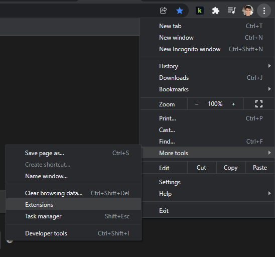
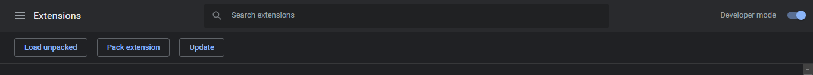
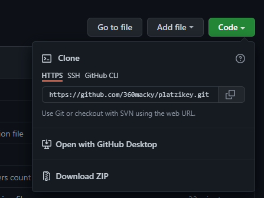
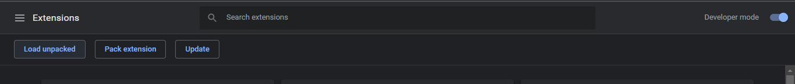

# ¿Cómo instalar PlatziKey?

Por el momento sólo existe la versión para Chrome.

1. Abre [chrome://extensions](chrome://extensions) en tu navegador.
   

2. Activa el modo Desarrollador.
   

3. Descarga o clona este repositorio en tu computador.
   
4. Si clonaste este repositorio, ve a **Load unpacked**, y carga la carpeta del repositorio. Si lo descargaste como `.zip`, primero desempaquétalo en una carpeta y después ve a **Load unpacked**, y carga la carpeta del repositorio.
   
5. Eso fue rápido. ¡Ya has instalado PlatziKey 🎉!

Esta extensión pronto será publicada en **Chrome Web Store** que facilitará por mucho la instalación.
