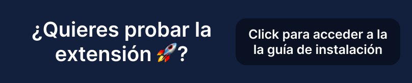

  
  <h1 align="center">Platzikey</h1>

🚀 Give awesome features to your <a href="https://platzi.com">Platzi Exams</a> with this browser extension 🦉.

  🤗 Thank you for visiting this browser extension project, help spread it by giving a star! 🌟 
   
   

## 💻 Development

PlatziKey is an extension targeting Chromium-based browsers like Chrome, Edge, and Brave. The main feature is to provide shortcuts (or hotkeys) to access the options of a Platzi exam, speeding up the process of choosing an answer to a question, and improving the experience of users who want to interact more with the keyboard than with the mouse.

### 🔭 Control Flow

The `content.js` file is executed in background everytime the page is loaded for the `"https://platzi.com/*"`

PlatziKey works with these permissions:

* `storage`: To store variables like `shortcuts`, `greenboard`, etc.
* `scripting`: To execute JavaScript scripts inside the page itself.

### ⌨️ Shortcuts Technology

To achieve this, PlatziKey [creates an eventlistener](https://developer.mozilla.org/en-US/docs/Web/API/EventTarget/addEventListener) inside window to listen for keypresses on keys `A`, `B`, `C`, `D`, `E` and `1`, `2`, `3`, `4`, `5` and `6`. Also `X` or `0` key to skip the question.

## 🚀 Features

### ⌨ PlatziKey Shortcuts

Select exam options faster with your own keyboard. Use letters, and numbers!

### 🖌 PlatziKey Greenboard

Open a fully integrated _whiteboard_ in your exam to be able to draw, do calculations or whatever you want.

### 🧐 PlatziKey Zen Mode

A new design that reduces the number of buttons and visual elements in the exam.

### 💻 PlatziKey SSH Mode

A terminal-style design to solve exams as if you were installing a package.

### New features 👀

The verision 3 of PlatKey will come with new features soon...

## 🏛️ History

This browser extension was made with the motive of **accelerating the speed of exam taking** in Platzi inspired by the way in which Typeform structures the shortcuts of its forms.

Keys were extended to not just letters (A, B, C...), but numbers (1, 2, 3). Then the whiteboard functionality was added for **drawing within the exam**, I called it **Greenboard**.

Finally two additional web themes to touch up the appearance of the exam.

**Zen Mode** is the name that many applications use for the _concentration_ mode that **reduces visual elements in the graphical interface**. We use it here as Zen Mode as well.

**SSH Mode** is a theme **inspired by the default terminal design**. A design similar to the command line interface of installing packages with Python, or initializing a project with ESLint.

## 🔩 Installation

### 🚅 Production (recommended)

Go to [PlatziKey Extension page](https://chrome.google.com/webstore/detail/platzikey/bdjedpeffgjikndcihipemgdinpcmpcf?hl=es-419), and click on "Add extension".

It works correctly in Google Chrome, Micorosft Edge and Brave.

### 🦊 Development

If you want the latest features of PlatziKey you can install the development version following [this tutorial](https://github.com/360macky/platzikey/blob/main/INSTALLATION.md).

## 🤲 Contributing

Do you would like to contribute? Do you want to be the author of a new feature? Awesome! please fork the repository and make changes as you like. [Pull requests](https://github.com/360macky/platzikey/pulls) are warmly welcome.

Also, you can check [Issues](https://github.com/360macky/platzikey/issues) to get any ideas on how to improve this browser extension.

## 📃 License

The source code is distributed under the MIT License.
See [`LICENSE`](./LICENSE) for more information.
