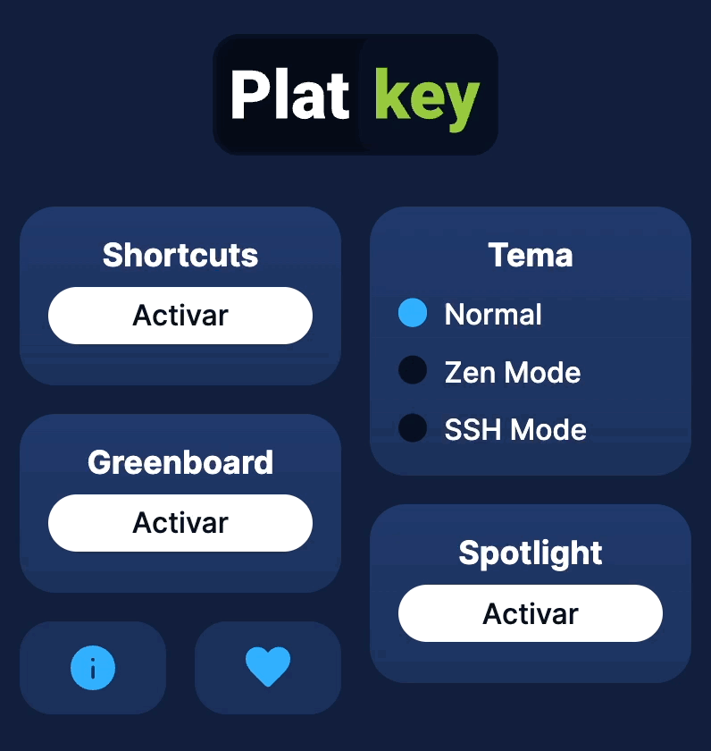
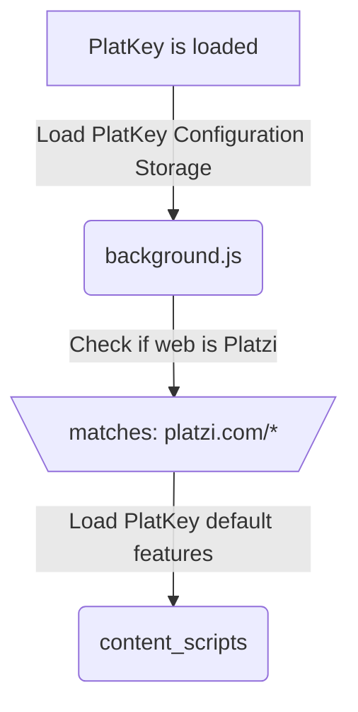

  
  <h1 align="center">PlatKey</h1>

🚀 Awesome features for <a href="https://platzi.com">Platzi</a> with this browser extension 🦉.

💚 Open Source, Free, and available for Chrome, Edge, Brave, Arc and Safari 🦁

  <a href="https://chrome.google.com/webstore/detail/platkey/bdjedpeffgjikndcihipemgdinpcmpcf">🤖 Install on Chromium Browser</a> -
  <a href="https://apps.apple.com/app/platkey/id1659587636">🍎 Install on Safari</a>

  

  <a href="https://platkey.dev">www.platkey.dev</a>

  🤗 Thank you for visiting this browser extension project, help spread it by giving a star! 🌟 
   
  🚀 Start participing in the development of this tool in the <a href="https://github.com/360macky/platkey/discussions">Discussions section</a>! 
   
   
   
  ✅ This project has diagrams to help you understand how it works! 📌 

## 🤖 Concept

**PlatKey** is a browser extension that helps you to solve exams faster in Platzi. And also the extension provides new functionalities to improve the experience of taking classes in Platzi.

Briefly the features of PlatKey are:

- **Shortcuts**: Select exam options faster with your own keyboard shortcuts. Also navigate between classes and make contributions using keyboard shortcuts.
- **Greenboard**: Open a fully integrated _whiteboard_ in your exam.
- **Zen Mode**: A new design that reduces the number of buttons and visual elements in the exam.
- **SSH Mode**: A terminal-style design to solve exams as if you were installing a package.
- **Highlight classes**: Select classes you want to highlight in your Student Home.
- **Save contributions**: Save contributions in your Student Home.
- **Spotlight**: A new design for the search bar of Platzi available with a keyboard shortcut.

It supports chromium-based browsers (like Chrome, Edge, Brave, Arc) and WebKit-based browsers (like Safari).

## 🚀 Features

Things you can do with **PlatKey**:

### ⌨ PlatKey Shortcuts

Select exam options faster with your own keyboard. Use letters, and numbers!

### 🖌 PlatKey Greenboard

Open a fully integrated _whiteboard_ in your exam to be able to draw, do calculations or whatever you want.

### 🧐 PlatKey Zen Mode

A new design that reduces the number of buttons and visual elements in the exam.

### 💻 PlatKey SSH Mode

A terminal-style design to solve exams as if you were installing a package.

### 📚 PlatKey Highlight classes

Select classes you want to highlight in your Student Home.

### 💾 PlatKey Save contributions

Save contributions in your Student Home.

## 💻 Core Development

This section is for developers who want to know how PlatKey works.

PlatKey has a software architecture targeted to be a browser extension for the Chrome Web Store.

### ⭐️ Version Workflow

The latest version of PlatKey used in production is 3.0.0. The source code you can download is the latest version of **PlatKey for Developers**. Which may contain features that are not yet available in stores, and may contain bugs.

### 📦 Architecture

PlatKey adopts an all-new architecture for browser extensions using TypeScript for the development of the modules. This enables better experience to interact with the Chrome API.

PlatKey uses Webpack for the compilation of the modules written in TypeScript. Webpack is configured into two modes: `development` and `production`.

PlatKey uses JSDocs for the documentation of the code.

PlatKey does not store information of the users. An account is not required to use the extension.

Information related to their extension preferences is stored in the browser's storage.

### ✅ Good practices

According to the [Google Chrome Web Store Developer Program Policies](https://developer.chrome.com/docs/webstore/best_practices/), PlatKey as a browser extension follows these good practices:

* **Manifest V3**: The extension uses the new Manifest V3 of Chrome.
* **Security**: The extension does not store information of the users. An account is not required to use the extension.
* **User privacy**: Information related to their extension preferences is stored in the browser's storage.
* **Performance**: The extension is optimized to be lightweight and fast.
* **User Experence**: The extension is designed to be easy to use and intuitive.

### 🔭 Control Flow

`manifest.json` file is the manifest of the extension. It contains the information of the extension and the permissions it needs.

`popup.html` file is the extension window. The `popup.js` file is the JavaScript code whose scope is in this window. It executed when the popup es opened.

`background.ts` file only contains the default storage information about the features of PlatKey. It's the service worker of the extension.

`content.ts` file is executed in background everytime the page is loaded for the `"https://platzi.com/*"`

### 🔓 Browser permissions

PlatKey works with these permissions:

- `storage`: To store variables like `shortcuts`, `greenboard`, etc.
- `scripting`: To execute JavaScript scripts inside the page itself.

### ⌨️ Shortcuts Technology

PlatKey [creates an eventlistener](https://developer.mozilla.org/en-US/docs/Web/API/EventTarget/addEventListener) inside window to listen for keypresses on keys `A`, `B`, `C`, `D`, `E` and `1`, `2`, `3`, `4`, `5` and `6`. Also `X` or `0` key to skip the question.

## 🔩 Installation

### 🚅 Production (recommended)

Go to [PlatKey Extension page](https://chrome.google.com/webstore/detail/PlatKey/bdjedpeffgjikndcihipemgdinpcmpcf?hl=es-419), and click on "Add extension".

It works correctly in Google Chrome, Micorosft Edge and Brave.

## 🏛️ History

This browser extension was made with the motive of **accelerating the speed of exam taking** in Platzi inspired by the way in which Typeform structures the shortcuts of its forms.

### 🦊 Development

If you want the latest features of PlatKey you can install the development version following [this tutorial](https://github.com/360macky/PlatKey/blob/main/INSTALLATION.md).

## 🤲 Contributing

Do you would like to contribute? Do you want to be the author of a new feature? Awesome! please fork the repository and make changes as you like. [Pull requests](https://github.com/360macky/PlatKey/pulls) are warmly welcome.

Also, you can check [Issues](https://github.com/360macky/PlatKey/issues) to get any ideas on how to improve this browser extension.

## 📃 License

The source code is distributed under the MIT License.
See [`LICENSE`](./LICENSE) for more information.
